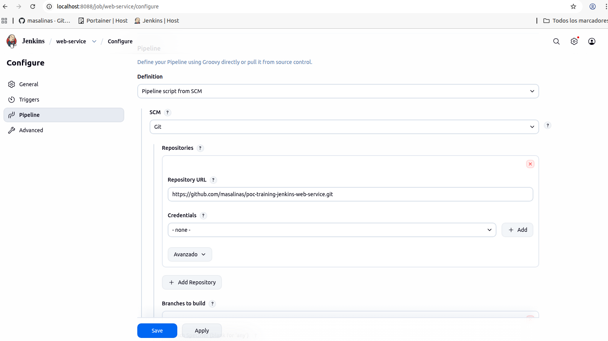
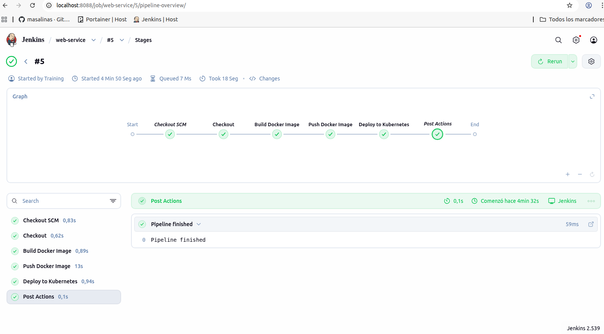
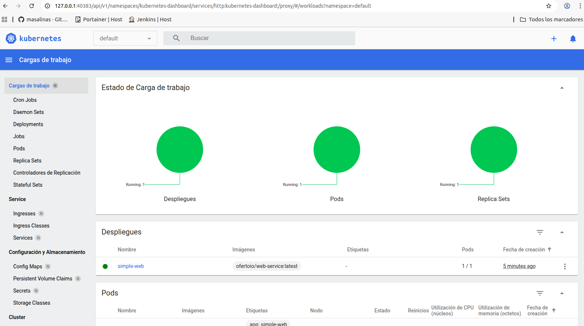
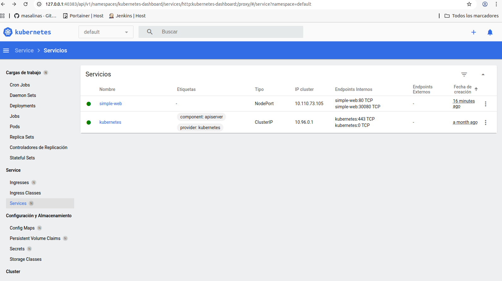
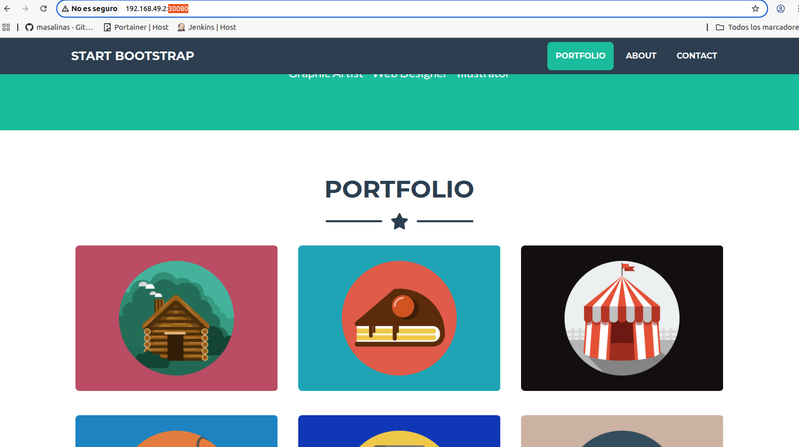
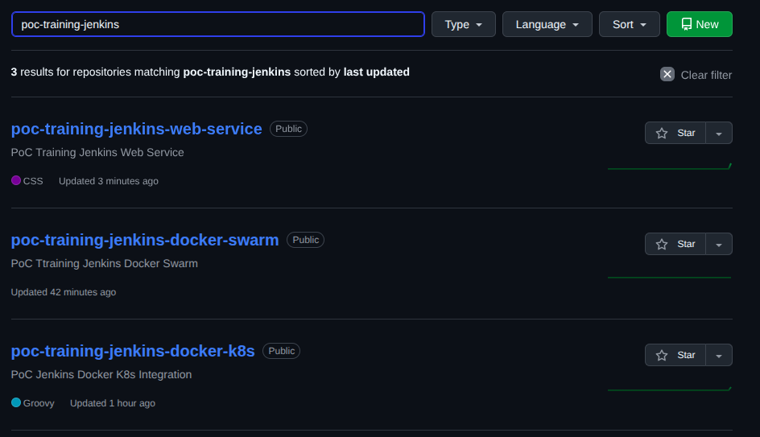

# Description
A simple Web frontend from [startbootstrap](https://startbootstrap.com/) Bootstrap Templates portal

## Build and Deploy in host
To build and deploy the service in host execute these steps:

- **STEP01**: Build image
    ```
    $ docker build -t web-service .
    ```

- **STEP02**: Run container
    ```
    $ docker run --name web-service -d -p 8081:80 web-service
    ```

## Build and Deploy in k8s
To build and deploy the service in k8s execute these steps:

- **STEP01**: Create the pipeline from repository code in jenkins:

    

- **STEP02**: Pipeline stages execution

    

- **STEP03**: Docker Image generated in Dockr Hub

    

- **STEP04**: Kubernetes resources deployed in default namespace

    

- **STEP05**: To acces to Web page
    Get the cluster IP
    ```
    $ minikube ip
    192.168.49.2
    ```

- **STEP06**: Get the nodeport generated from kubernetes service called web-service in default namespace

    

- **STEP07**: Load from broweset using the nodeport geberated
    ```
    http://192.168.49.2:30080
    ```

    


## Repositories:

All repositories related to Jenkins integration with Docker swarm and Kubernetes

- [poc-training-jenkins-docker-swarm](https://github.com/masalinas/poc-training-jenkins-docker-swarm): Deploy a Docker Swarm using Docker Containers.

- [poc-training-jenkins-docker-k8s](https://github.com/masalinas/poc-training-jenkins-docker-k8s): Deploy and Test the Jenkins CI/CD service integration with Host Docker and Kubernetes.

- [poc-training-jenkins-web-service](https://github.com/masalinas/poc-training-jenkins-web-service): Frontend microservice to be deployed in Docker Swarm or Kubernetes using Jenkins pipelines


